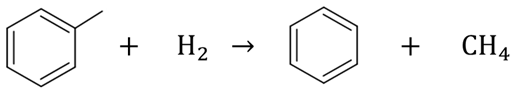

# Autonomous Process Design With Reinforcement Learning (RL)
This document serves as a comprehensive guide for individuals who will continue or utilize this research, providing detailed explanations of the project's content, file architecture, and program implementation.   
 
For further details regarding the project files, please refer to the main repository: https://github.com/hijiku/AutoProcRL/tree/main
# Overview
* This project is fundamentally based on the RL framework with a masking mechanism as proposed by Reynoso et al.
* The original system has been extended to include a broader variety of unit operations and features an enhanced reward setting.
* The system is designed to autonomously generate process flowsheets in chemical engineering with RL.
* It operates using Aspen Plus (v8.8).
* Execution is initiated by running the main.ipynb notebook.
* It is highly recommended to execute the program within a notebook environment like Google Colab or JupyterLab.
# Agent
RL agent employs the Proximal Policy Optimization (PPO) algorithm. The agent is composed of an Actor and a Critic and integrates a "masking" function to ensure valid action selections. The implementation of this agent is detailed in agent.py.
# Environment
RL environment is simulated using Aspen Plus. The Aspen Plus flowsheet functions as the environment, with its configuration parameters managed by env.py. The interface and connection with the Aspen Plus simulator are handled by Simulation.py.
# Case Study
The case study investigates the synthesis of benzene (BZN) via the thermal dealkylation of toluene (TOL) with hydrogen:

   Benzene + Methane" width="300"/>

The primary objective was to enhance the generalizability of existing RL-based process design methodologies. This was achieved by expanding the agent's functional capabilities and refining the reward function. A comparative analysis demonstrated that proposed method yielded a more economically viable process than conventional techniques. These findings validate the utility of RL as a powerful tool for autonomous chemical process design.
